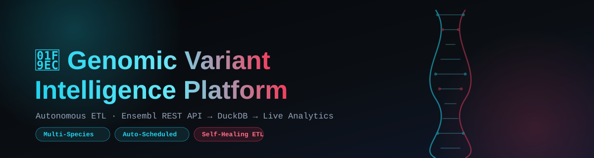
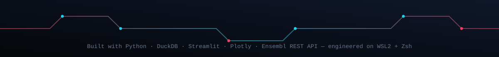

<div align="center">
  
</div>

<div align="center">

[](https://genomic-variant-platform.streamlit.app)
[](../../actions)
[](https://www.python.org/)
[](LICENSE)

</div>

## Overview

**Genomic Variant Intelligence Platform** is a self-updating bioinformatics dashboard that turns raw variant data from the [Ensembl REST API](https://rest.ensembl.org) into an explorable, visual profile for any gene — human or otherwise. Search a gene symbol you already know, an Ensembl ID, or an NCBI accession number, and the platform resolves it, fetches every known variant, and renders consequence distributions, positional mutation maps, and clinical significance breakdowns in seconds.

A daily automated pipeline keeps a starter set of clinically significant genes (`BRCA1`, `TP53`, `EGFR`, `CFTR`, `HBB`) pre-cached in a [DuckDB](https://duckdb.org/) database so the dashboard opens with instant results, while anything outside that set is fetched live, on demand, the first time someone searches for it.

This project was designed, built, and debugged end-to-end on **WSL2 (Ubuntu) running Zsh**, using GitHub Actions as the automation backbone — no external server or cron job required.

---

## Key Features

- 🔍 **Smart identifier detection** — accepts HGNC gene symbols (`TP53`), Ensembl Gene IDs (`ENSG00000141510`), or NCBI accession numbers (`NM_000546`) and automatically routes each to the correct Ensembl endpoint.
- 🧬 **Multi-species support** — Human, Mouse, Chicken, and Goat genomes, selectable from the UI.
- ⚡ **On-demand ETL** — any gene not already cached is extracted, transformed, and loaded into DuckDB live, the moment it's searched.
- 🔁 **Resilient retry logic** — transient Ensembl server errors (5xx, rate limits) are retried automatically; permanent client errors (invalid gene/species combinations) fail fast instead of wasting time on doomed retries.
- 🗄️ **Idempotent loading** — re-running the pipeline (daily, or manually) never duplicates rows; each load deletes and replaces that gene's existing records first.
- 🤖 **Fully automated daily refresh** — a GitHub Actions workflow re-runs the ETL pipeline every day and commits the refreshed database straight back to `main`.
- 📊 **Interactive analytics** — variant consequence bar charts, positional scatter maps, and clinical significance donut charts, built with Plotly.
- ☁️ **Zero-infrastructure deployment** — runs entirely on Streamlit Community Cloud, with no external database server or paid hosting.

---

## Tech Stack

| Layer | Technology |
|---|---|
| Language | Python 3.10 |
| Data source | [Ensembl REST API](https://rest.ensembl.org) |
| Database | DuckDB (embedded, file-based) |
| Dashboard | Streamlit |
| Visualization | Plotly Express |
| Data handling | Pandas |
| Automation | GitHub Actions (`workflow_dispatch` + daily `cron`) |
| Environment manager | [`uv`](https://github.com/astral-sh/uv) |
| Development environment | WSL2 (Ubuntu) + Zsh |

---

## Architecture: How the Pipeline Works

```
┌─────────────┐      ┌───────────────┐      ┌──────────────┐      ┌─────────────┐
│   Ensembl    │ ---> │   extract.py   │ ---> │ transform.py │ ---> │   load.py   │
│  REST API    │      │ (identify +    │      │ (flatten to  │      │ (dedupe +   │
│              │      │  fetch, retry) │      │  DataFrame)  │      │  write to   │
└─────────────┘      └───────────────┘      └──────────────┘      │   DuckDB)    │
                                                                     └─────────────┘
```

1. **`extract.py`** — Detects whether the input is an Ensembl ID (`ENS...`), an accession number (`NM_`, `NP_`, `NG_`, `NC_`, `LRG_`), or a plain gene symbol, and resolves it to a canonical Ensembl Gene ID. Every HTTP call goes through a shared retry helper that retries transient failures (5xx / 429) up to 3 times with a short backoff, but **fails immediately** on 4xx client errors — since those mean the identifier simply doesn't exist under the selected species, and retrying won't change that.
2. **`transform.py`** — Flattens Ensembl's raw JSON variant records into a clean, typed Pandas DataFrame (`gene_symbol`, `variant_id`, `chromosome`, `start_position`, `end_position`, `consequence`, `clinical_significance`).
3. **`load.py`** — Writes the DataFrame into DuckDB against an explicit schema (shared with the dashboard, so local and CI-created databases never drift into different column types). Before inserting, it deletes any existing rows for that gene, making every load idempotent — running the pipeline once or a hundred times produces the same result.
4. **`pipeline.py`** — Orchestrates all three phases across a starter pack of genes, with a short pause between requests to stay within Ensembl's rate limits.
5. **`app/dashboard.py`** — The Streamlit frontend. Checks DuckDB first; if the requested gene isn't cached, it runs the same extract → transform → load sequence live, then renders the result.

---

## Project Structure

```
genomic-variant-platform/
├── app/
│   └── dashboard.py          # Streamlit UI + on-demand fetch logic
├── src/
│   ├── extract.py            # Ensembl API extraction + retry logic
│   ├── transform.py          # Raw JSON → clean DataFrame
│   ├── load.py                # DataFrame → DuckDB (idempotent)
│   └── pipeline.py           # Orchestrates the starter-gene ETL run
├── data/
│   └── processed/
│       └── genomic_data.duckdb   # Committed cache, refreshed daily
├── .github/
│   └── workflows/
│       └── etl.yml           # Daily automation + auto-commit
├── assets/
│   ├── readme-header.svg
│   └── readme-footer.svg
├── requirements.txt
└── README.md
```

---

## Getting Started (Local Setup)

This project was built and tested on **WSL2 (Ubuntu) with Zsh**. The steps below assume the same environment, but work equally well on native Linux or macOS.

**1. Clone the repository**
```zsh
git clone https://github.com/AbdulRaffayQureshi/genomic-variant-platform.git
cd genomic-variant-platform
```

**2. Set up a virtual environment**
```zsh
python3 -m venv .venv
source .venv/bin/activate
```

**3. Install dependencies**
```zsh
pip install -r requirements.txt
```

**4. Run the dashboard locally**
```zsh
streamlit run app/dashboard.py
```
The app will be available at `http://localhost:8501`.

**5. (Optional) Run the ETL pipeline manually**
```zsh
python3 src/pipeline.py
```
This re-fetches and reloads the starter gene pack (`BRCA1`, `TP53`, `EGFR`, `CFTR`, `HBB`) into `data/processed/genomic_data.duckdb`.

---

## Automation: Daily ETL via GitHub Actions

The workflow at `.github/workflows/etl.yml` runs on two triggers:

- **Scheduled** — every day at `04:00 UTC` (`09:00 AM PKT`)
- **Manual** — via the "Run workflow" button in the Actions tab (`workflow_dispatch`)

Each run:
1. Spins up a fresh Ubuntu runner and installs dependencies with `uv`.
2. Executes `src/pipeline.py` to refresh the starter gene pack.
3. Uploads the resulting `.duckdb` file as a downloadable workflow artifact (7-day retention).
4. **Commits the refreshed database back to `main`** using `stefanzweifel/git-auto-commit-action`, so the live Streamlit Cloud deployment picks up the fresh data automatically on its next redeploy.

> **Note on live, on-demand searches:** genes fetched live through the dashboard (rather than the starter pack) are written to the container's local DuckDB file, not committed back to GitHub. They persist until the app container restarts or redeploys, at which point they'd be re-fetched from Ensembl if searched again — this is expected behavior given Streamlit Cloud's ephemeral filesystem, not a bug.

---

## Supported Species & Input Types

| Species | Ensembl Code | Example Symbol | Example Accession | Example Ensembl ID |
|---|---|---|---|---|
| Human | `homo_sapiens` | `TP53` | `NM_000546` | `ENSG00000141510` |
| Mouse | `mus_musculus` | `Trp53` | `NM_011640` | `ENSMUSG00000059552` |
| Chicken | `gallus_gallus` | `BRCA1` | — | `ENSGALG00000010825` |
| Goat | `capra_hircus` | `CSN1S1` | — | `ENSCHIG00000013327` |

---

## Deployment

Live at **[genomic-variant-platform.streamlit.app](https://genomic-variant-platform.streamlit.app)**, deployed via [Streamlit Community Cloud](https://streamlit.io/cloud), pointed at `app/dashboard.py` on the `main` branch. No secrets or API keys are required — Ensembl's REST API is public, and DuckDB requires no external credentials.

---

## Roadmap

- [ ] Push live-fetched genes back to the committed database (via an authenticated write-back step) so on-demand searches persist across redeploys
- [ ] Add more species (Zebrafish, Rat, Fowl Adenovirus for viral genomics work)
- [ ] Variant-level cross-referencing with ClinVar for richer clinical annotation
- [ ] Unit test coverage for the extract/transform/load layers

---

## Author

Built by **Abdul Raffay Qureshi** — BS Bioinformatics, COMSATS University Islamabad.
GitHub: [@AbdulRaffayQureshi](https://github.com/AbdulRaffayQureshi)

<div align="center">
  
</div>